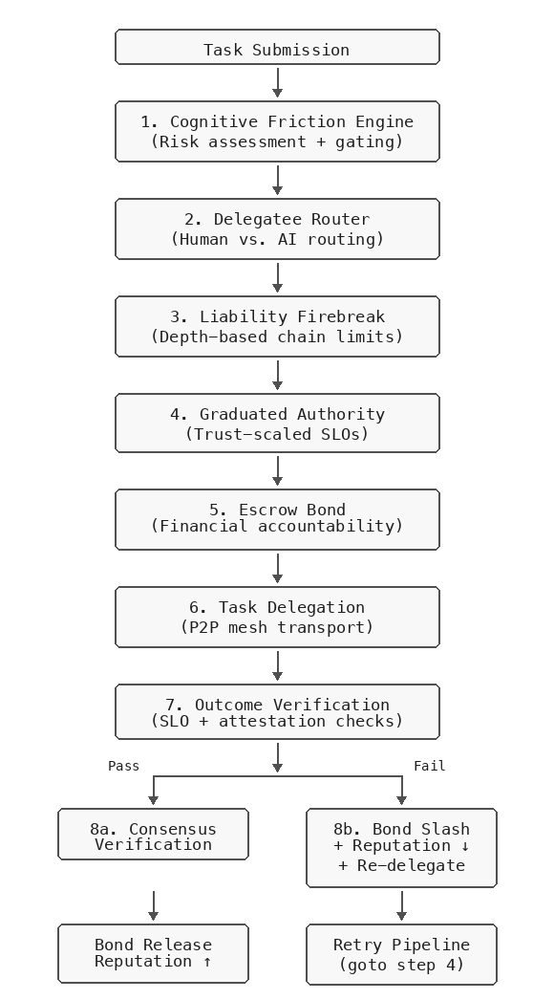
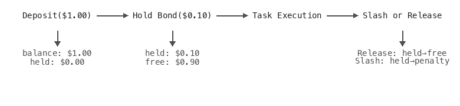
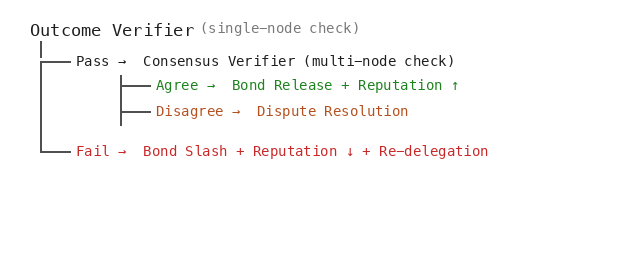

# Intelligent AI Delegation: From Theory to Working Code

## A Reference Implementation of Google DeepMind's *Intelligent AI Delegation* (2026) Framework for Autonomous Agent Swarms

**[KarnEvil9 Project](https://github.com/oldeucryptoboi/KarnEvil9)** | February 2026

---

> *"Existing task decomposition and delegation methods rely on simple heuristics, and are not able to dynamically adapt to environmental changes and robustly handle unexpected failures."*
> — Tomasev, Franklin & Osindero, "Intelligent AI Delegation" [1]

---

## Abstract

In February 2026, Tomasev, Franklin, and Osindero of Google DeepMind published "Intelligent AI Delegation" [1], a foundational paper that formalized the distinction between ad hoc delegation — fire-and-forget task handoff — and *intelligent delegation*: "a sequence of decisions involving task allocation, that also incorporates transfer of authority, responsibility, accountability, clear specifications regarding roles and boundaries, clarity of intent, and mechanisms for establishing trust." The paper proposed a comprehensive framework organized around five pillars — dynamic assessment, adaptive execution, structural transparency, scalable market coordination, and systemic resilience — but left the implementation as an open challenge.

This paper answers that challenge. We present [KarnEvil9's swarm package](https://github.com/oldeucryptoboi/KarnEvil9/tree/master/packages/swarm): a complete, working implementation of the Tomasev et al. framework, translating every pillar into concrete, runnable code. Each of the nine safety mechanisms we implement — cognitive friction, liability firebreaks, graduated authority, escrow bonds, outcome verification, consensus verification, reputation tracking, delegatee routing, and re-delegation — traces directly to specific sections and prescriptions in [1]. Nothing in our architecture is invented independently; the entire design is derived from the *Intelligent AI Delegation* paper's theoretical framework.

We demonstrate the framework through a controlled experiment: the same security audit task is delegated twice across a three-node peer-to-peer mesh — once with no safety infrastructure, once with the full framework. The results are unambiguous: naive delegation accepts garbage in 2.8 seconds with no recourse; intelligent delegation detects the degradation, slashes the offending peer's bond, downgrades its reputation, re-delegates to a reliable peer, achieves consensus verification, and delivers a verified high-quality result — all in under 3.1 seconds with zero human intervention.

The entire framework is implemented in TypeScript, runs in a single process with no external dependencies, and is available as the [`@karnevil9/swarm`](https://github.com/oldeucryptoboi/KarnEvil9/tree/master/packages/swarm) package.

---

## Table of Contents

1. [The Problem: Delegation Without Governance](#1-the-problem-delegation-without-governance)
2. [Threat Model](#2-threat-model)
3. [Framework Architecture](#3-framework-architecture)
4. [Component Deep Dives](#4-component-deep-dives)
   - 4.1 [Cognitive Friction Engine](#41-cognitive-friction-engine)
   - 4.2 [Liability Firebreaks](#42-liability-firebreaks)
   - 4.3 [Delegatee Router](#43-delegatee-router)
   - 4.4 [Graduated Authority](#44-graduated-authority)
   - 4.5 [Escrow Bond Manager](#45-escrow-bond-manager)
   - 4.6 [Outcome Verifier](#46-outcome-verifier)
   - 4.7 [Consensus Verifier](#47-consensus-verifier)
   - 4.8 [Reputation Store](#48-reputation-store)
   - 4.9 [Re-delegation and Recovery](#49-re-delegation-and-recovery)
5. [The Demonstration: Naive vs. Intelligent](#5-the-demonstration-naive-vs-intelligent)
6. [Quantitative Results](#6-quantitative-results)
7. [Integration: How the Components Compose](#7-integration-how-the-components-compose)
8. [Design Decisions and Trade-offs](#8-design-decisions-and-trade-offs)
9. [Related Work](#9-related-work)
10. [Future Directions](#10-future-directions)
11. [Conclusion](#11-conclusion)
12. [References](#references)

---

## 1. The Problem: Delegation Without Governance

Modern AI agent architectures are converging on a common pattern: a *principal* agent decomposes complex tasks into subtasks and delegates them to *subordinate* agents. This pattern appears in multi-agent frameworks, tool-use pipelines, and orchestration runtimes. The appeal is obvious — parallelism, specialization, and scalability.

The problem is equally obvious, yet widely ignored: **what happens when a delegatee fails silently?**

The *Intelligent AI Delegation* paper [1] frames this as the *principal-agent problem* (§2.3): "a situation that arises when a principal delegates a task to an agent that has motivations that are not in alignment with that of the principal." In AI delegation, this misalignment need not be intentional — it can manifest as reward misspecification, capability mismatch, or simple resource exhaustion. The result is the same: the principal receives degraded output and has no mechanism to detect it.

Consider a security audit task delegated to a peer agent. The peer returns after 2.8 seconds with a single finding: *"Code looks okay. No major issues found. Recommend further review."* This result consumed 800 tokens, cost $0.05, and tells the principal nothing of value. Yet in a naive delegation system, the principal accepts this result without question. The task is marked "completed." The user sees a green checkmark. The security vulnerabilities remain.

This is not a hypothetical. It is the default behavior of every multi-agent system that lacks explicit verification infrastructure. As the paper argues: "existing task decomposition and delegation methods rely on simple heuristics, and are not able to dynamically adapt to environmental changes and robustly handle unexpected failures" [1]. The failure modes compound:

- **Silent quality degradation**: A degraded peer returns plausible but useless results. Without SLO checks, the principal cannot distinguish quality work from noise. The peer operates within its *zone of indifference* [1, §2.3] — technically compliant, but not critically engaged.
- **Unchecked cost accumulation**: A slow, expensive peer burns through token budgets. Without cost bounds, the principal pays for garbage. *Transaction cost economies* [1, §2.3] demand that the overhead of monitoring and verification be weighed against delegation benefits.
- **No accountability**: A consistently unreliable peer continues receiving tasks. Without reputation tracking, the system cannot learn from failure. *Trust calibration* [1, §2.3] requires that "the level of trust placed in a delegatee is aligned with their true underlying capabilities."
- **No recovery path**: When a delegation fails, the task simply fails. Without re-delegation, there is no second chance. *Adaptive coordination* [1, §4.4] demands the capability to "switch delegatees mid-execution" when "performance degrades beyond acceptable parameters."
- **Invisible chain risk**: When a delegatee further sub-delegates, the principal loses visibility. Without depth-based governance, delegation chains grow unbounded. The paper warns that in chains (A → B → C), "a broad zone of indifference allows subtle intent mismatches or context-dependent harms to propagate rapidly downstream" [1, §2.3].

Tomasev et al. [1] identified all of these failure modes and proposed a comprehensive framework centered on five requirements: *dynamic assessment*, *adaptive execution*, *structural transparency*, *scalable market coordination*, and *systemic resilience* [1, §4]. Their paper provided the theoretical architecture; it did not provide an implementation. The [KarnEvil9](https://github.com/oldeucryptoboi/KarnEvil9) swarm package exists because that paper exists. Every component described in the following sections — from cognitive friction to consensus verification — was designed to implement a specific prescription from [1]. The contribution of this work is turning that theory into running code that can be executed in under 5 seconds on a laptop.

---

## 2. Threat Model

Google DeepMind's *Intelligent AI Delegation* paper [1, §4.9] provides a comprehensive security threat taxonomy for intelligent delegation, categorizing threats by the locus of the attack vector: malicious delegatees, malicious delegators, and ecosystem-level threats. Our framework addresses four primary categories drawn from this taxonomy:

### 2.1 Degraded Peers

The most common failure mode. A peer is technically operational but produces low-quality results — slow response times, excessive token usage, vague or shallow findings. This may result from the peer being overloaded, using a weaker model, or simply being poorly configured. The key characteristic is that the peer *returns a result* (status: "completed"), so naive systems accept it. The paper classifies this under internal triggers for adaptive coordination: "a particular delegatee may be experiencing performance degradation, failing to meet the agreed-upon service level objectives" [1, §4.4].

### 2.2 Byzantine Peers

A peer returns deliberately incorrect or misleading results. The paper identifies several specific attack vectors [1, §4.9]: *data poisoning* (returning subtly corrupted data), *verification subversion* (jailbreaking AI critics used in task completion verification), and *backdoor implanting* (embedding concealed vulnerabilities within generated artifacts). Byzantine behavior requires multi-party verification to detect.

### 2.3 Transitive Chain Risk

When peer A delegates to peer B, who delegates to peer C, the original principal has no visibility into the chain. Each hop adds latency, cost, and failure probability. The paper formalizes this as the problem of *transitive monitoring* [1, §4.5]: "In such delegation chains, it may not be feasible for the original delegator (Agent A) to directly monitor agent C to the same extent to which it monitors B." Without depth limits and *liability firebreaks* [1, §5.2], chains can grow unbounded, creating what the paper calls an "accountability vacuum."

### 2.4 Cost and Resource Exhaustion

A peer consumes far more resources (tokens, time, money) than expected. The paper categorizes this as *resource exhaustion*: "Delegatee engages in a denial-of-service attack by intentionally consuming excessive computational or physical resources" [1, §4.9]. Without cost bounds enforced by contract, the principal bears unlimited financial risk.

The framework does *not* address ecosystem-level threats such as *Sybil attacks*, *collusion*, *agentic viruses*, or *cognitive monoculture* [1, §4.9] — these are handled by separate infrastructure layers. Similarly, network-level attacks (MITM, DDoS) and compromised cryptographic keys are out of scope.

---

## 3. Framework Architecture

Our architecture is a direct translation of the framework defined in the *Intelligent AI Delegation* paper [1, §4]. The paper organizes intelligent delegation around five pillars (reproduced from Table 1 of [1]), and every component in our implementation traces to one or more of these pillars:

| Framework Pillar [1] | Core Requirement | Our Implementation |
|----------------------|------------------|--------------------|
| **Dynamic Assessment** | Granular inference of agent state | Cognitive Friction Engine, Delegatee Router |
| **Adaptive Execution** | Handling context shifts | Re-delegation pipeline, External triggers |
| **Structural Transparency** | Auditability of process and outcome | Outcome Verifier, Consensus Verifier, Journal |
| **Scalable Market** | Efficient, trusted coordination | Escrow Bonds, Reputation Store |
| **Systemic Resilience** | Preventing systemic failures | Liability Firebreaks, Graduated Authority |

The intelligent delegation framework composes nine components into a layered pipeline. Each component operates independently but integrates through shared types and a journal-based event system.



The critical insight is that these components form a *closed loop*. Failure at step 7 triggers recovery at step 8b, which feeds back into the delegation pipeline at step 4 with updated reputation data. The system learns from each delegation cycle.

---

## 4. Component Deep Dives

### 4.1 [Cognitive Friction Engine](https://github.com/oldeucryptoboi/KarnEvil9/blob/master/packages/swarm/src/cognitive-friction.ts)

**Paper basis**: §2.3 (Zone of Indifference, Dynamic Cognitive Friction) and §5.1 (Meaningful Human Control).

**Purpose**: Prevent automation complacency by requiring graduated human oversight based on task risk. The paper introduces *dynamic cognitive friction* as a counter to the *zone of indifference* — "a range of instructions that are executed without critical deliberation or moral scrutiny" [1, §2.3]. When delegation chains lengthen, "each agent acting as an unthinking router rather than a responsible actor" allows harms to propagate downstream. Cognitive friction forces agents to "step outside their zone of indifference to challenge the delegator or request human verification" [1, §2.3].

The cognitive friction engine assesses delegation risk across five weighted factors:

| Factor | Source | Weight | Mapping |
|--------|--------|--------|---------|
| Criticality | Task attributes | 0.30 | low→0.2, medium→0.5, high→0.9 |
| Irreversibility | Inverse of reversibility | 0.25 | low rev.→0.9, medium→0.5, high rev.→0.1 |
| Uncertainty | Inverse of verifiability | 0.20 | low ver.→0.9, medium→0.5, high ver.→0.1 |
| Depth ratio | Delegation chain depth | 0.15 | `min(depth / max_depth, 1.0)` |
| Trust deficit | Peer reputation | 0.10 | `max(0, 1 - trust_score)` |

The composite score maps to four friction levels:

| Composite Score | Friction Level | Action |
|----------------|----------------|--------|
| < 0.30 | `none` | Automatic approval |
| 0.30 – 0.59 | `info` | Logged notification |
| 0.60 – 0.84 | `confirm` | Requires user confirmation |
| >= 0.85 | `mandatory_human` | Blocks delegation; forces human review |

**Anti-alarm fatigue**: The paper explicitly warns that "cognitive friction also needs to be balanced against the risk of introducing alarm fatigue — becoming desensitised to constant, often false, alarms" [1, §5.1]. The engine addresses this by tracking escalation frequency within a rolling 5-minute window. After 5 escalations, it automatically downgrades `confirm` to `info` and `info` to `none`. The `mandatory_human` level is *never* downgraded — it represents a hard safety boundary. As the paper prescribes, "friction must be context-aware: the system should allow seamless execution for tasks with low criticality or low uncertainty, but dynamically increase cognitive load" for higher-risk scenarios [1, §5.1].

**In the demo**: The task has high criticality, low reversibility, and a low-trust target peer (trust=0.29). The composite score of 0.716 triggers the `confirm` level, flagging the delegation as requiring user approval before proceeding.

### 4.2 [Liability Firebreaks](https://github.com/oldeucryptoboi/KarnEvil9/blob/master/packages/swarm/src/liability-firebreak.ts)

**Paper basis**: §5.2 (Accountability in Long Delegation Chains) and §4.5 (Monitoring — transitive monitoring).

**Purpose**: Prevent unbounded transitive delegation chains by enforcing depth limits that tighten based on task risk. The paper identifies the core problem: "In long delegation chains (X → A → B → C → ... → Y), the increased distance between the original intent (X) and the ultimate execution (Y) may result in an accountability vacuum" [1, §5.2]. The paper proposes *liability firebreaks* as "predefined contractual stop-gaps where an agent must either: 1. Assume full, non-transitive liability for all downstream actions... or 2. Halt execution and request an updated transfer of authority from the human principal" [1, §5.2].

The firebreak calculates an effective maximum delegation depth:

```
effective_max_depth = base_max_depth                    // default: 3
if (criticality === "high"):  -= criticality_reduction  // default: -1
if (reversibility === "low"): -= reversibility_reduction // default: -1
effective_max_depth = max(effective_max_depth, min_depth) // floor: 1
```

For a high-criticality, low-reversibility task, the effective max depth is `max(3 - 1 - 1, 1) = 1`. This means the task can be delegated exactly once — no further sub-delegation is permitted.

The firebreak operates in two modes:
- **Strict** (default): Returns `halt` — the delegation is blocked outright.
- **Permissive**: Returns `request_authority` — the delegation proceeds only if a higher authority explicitly approves.

**In the demo**: The firebreak is wired into the [mesh manager](https://github.com/oldeucryptoboi/KarnEvil9/blob/master/packages/swarm/src/mesh-manager.ts). Any attempt by Node C to sub-delegate the task would be blocked because the depth limit for this task profile is 1.

### 4.3 [Delegatee Router](https://github.com/oldeucryptoboi/KarnEvil9/blob/master/packages/swarm/src/delegatee-router.ts)

**Paper basis**: §4.1 (Task Decomposition — human vs. AI routing) and §4.2 (Task Assignment).

**Purpose**: Decide whether a subtask should be delegated to an AI peer, a human, or either. The paper frames this as a core responsibility of task decomposition: "Delegators need to decide if sub-tasks require human intervention, whether due to AI agent unreliability, unavailability, or domain-specific requirements for human-in-the-loop oversight" [1, §4.1]. The decomposition engine must "balance the speed and low cost of AI agents against domain-specific necessities of human judgement" [1, §4.1].

The router evaluates five routing factors derived from task attributes:

| Factor | Computation |
|--------|-------------|
| Criticality score | low→0.2, medium→0.5, high→0.9 |
| Reversibility score | low→0.1, medium→0.5, high→0.9 |
| Verifiability score | low→0.2, medium→0.5, high→0.9 |
| Subjectivity score | Inverse of verifiability |
| Cost-benefit score | low→0.3, medium→0.6, high→0.9 |

Routing rules are evaluated in priority order:

1. **High criticality + Low reversibility** → `human` (confidence 0.90): Irreversible high-stakes decisions require human judgment.
2. **Low verifiability** → `human` (confidence 0.80): If the outcome cannot be objectively verified, a human must assess quality.
3. **High subjectivity** → `human` (confidence 0.75): Subjective tasks benefit from human evaluation.
4. **High verifiability + Low criticality** → `ai` (confidence 0.90): Objectively measurable, low-stakes tasks are safe to automate.
5. **Default** → `any` (confidence 0.60): No strong signal; either delegation type is acceptable.

**In the demo**: The security audit task has high criticality and low reversibility, triggering rule 1. The router recommends human oversight with 0.90 confidence. In a production system, this would gate the delegation behind a human approval step.

### 4.4 [Graduated Authority](https://github.com/oldeucryptoboi/KarnEvil9/blob/master/packages/swarm/src/graduated-authority.ts)

**Paper basis**: §2.3 (Authority Gradient, Trust Calibration), §4.6 (Trust and Reputation), and §4.7 (Permission Handling).

**Purpose**: Scale Service Level Objectives (SLOs), monitoring intensity, and permission boundaries based on peer trust. The paper introduces the *authority gradient* — "coined in aviation... scenarios where significant disparities in capability, experience, and authority impede communication, leading to errors" [1, §2.3]. Applied to delegation, graduated authority prevents both over-trusting unreliable peers and over-constraining reliable ones. The paper notes that "trust informs the dynamic scoping of authority and autonomy. This mechanism of graduated authority results in low-trust agents facing strict constraints, such as transaction value caps and mandatory oversight, while high-reputation agents operate with minimal intervention" [1, §4.6].

Trust scores (0.0–1.0) map to three tiers:

| Trust Score | Tier | Budget Factor | Monitoring Level | Checkpoint Interval | Max Permissions |
|-------------|------|---------------|------------------|--------------------:|----------------:|
| < 0.30 | Low | 0.5x | L2 (CoT trace) | 15 seconds | 3 |
| 0.30 – 0.69 | Medium | 1.0x | L1 (high-level plan) | 60 seconds | 10 |
| >= 0.70 | High | 1.5x | L0 (operational) | None | Unlimited |

The budget factor scales all SLO dimensions proportionally:

```
scaled_SLO = {
  max_duration_ms:  round(base_duration  × budget_factor)
  max_tokens:       round(base_tokens    × budget_factor)
  max_cost_usd:     base_cost × budget_factor
}
```

**The key insight**: Low-trust peers receive *tighter* budgets, not looser ones. A peer with a history of cost overruns gets a *lower* cost ceiling. This creates a natural feedback loop: poor performance → lower trust → tighter constraints → faster SLO violations → stronger accountability signals.

**In the demo**: Node C (trust=0.29, low tier) receives an SLO of 2,500ms / 250 tokens / $0.005 — half the base budget. Node B (trust=1.00, high tier) receives 7,500ms / 750 tokens / $0.015 — 1.5x the base budget. When Node C returns after 2,800ms with 800 tokens at $0.05, it violates all three SLO dimensions simultaneously.

### 4.5 [Escrow Bond Manager](https://github.com/oldeucryptoboi/KarnEvil9/blob/master/packages/swarm/src/escrow-manager.ts)

**Paper basis**: §4.2 (Task Assignment — smart contracts, escrow) and §4.8 (Verifiable Task Completion — dispute resolution).

**Purpose**: Provide financial accountability through stake-and-slash mechanics. The paper prescribes that "successful matching should be formalized into a smart contract that ensures that the task execution faithfully follows the request. The contract must pair performance requirements with specific formal verification mechanisms for establishing adherence and automated penalties actioned for contract breaches" [1, §4.2]. Specifically, contracts must include "an *arbitration clause* and an *escrow bond*. To operationalise trust via cryptoeconomic security, the delegatee is required to post a financial stake into the escrow bond prior to execution, ensuring rational adherence" [1, §4.8].

The bond lifecycle:



**Bond operations**:
- **Deposit**: Add funds to a peer's escrow account.
- **Hold**: Lock a specified amount against a task ID. Requires `free_balance >= amount`.
- **Release**: Return held funds to free balance after successful task completion.
- **Slash**: Forfeit a percentage of the held bond. Default: 50% on SLO violation, 25% on timeout.

**Economic incentive**: Peers must stake capital before receiving delegated work. If they perform poorly, they lose money. If they perform well, they get their stake back. This creates a direct economic incentive for quality, independent of any reputation system.

**In the demo**: A $0.10 bond is held for Node C before delegation. When the SLO violation is detected, 50% ($0.05) is slashed. Node C's remaining balance drops to $0.95. This slashed revenue partially offsets the cost of re-delegating to Node B.

### 4.6 [Outcome Verifier](https://github.com/oldeucryptoboi/KarnEvil9/blob/master/packages/swarm/src/outcome-verifier.ts)

**Paper basis**: §4.8 (Verifiable Task Completion) and §4.1 (contract-first decomposition).

**Purpose**: Verify task results against contractual SLOs with multi-method attestation. The paper frames verification as "the contractual cornerstone of the framework, enabling the delegator to formally *close* the task and trigger the settlement of agreed transactions" [1, §4.8]. Verification is not an afterthought — the paper's *contract-first decomposition* principle (§4.1) "demands that task granularity be tailored *a priori* to match available verification capabilities, ensuring that every delegated objective is inherently verifiable" [1, §4.8]. The paper categorizes verification into four methods: direct outcome inspection, trusted third-party auditing, cryptographic proofs (zk-SNARKs), and game-theoretic consensus [1, §4.8].

The verifier performs six checks in sequence:

1. **SLO compliance**: Duration, token count, and cost are each compared against the contract's graduated SLO. Any breach marks `slo_compliance = false`.

2. **Ed25519 signature verification** (strongest): If the result includes an Ed25519-signed attestation and the peer's public key is known, cryptographic verification is attempted first.

3. **HMAC attestation verification**: If no Ed25519 signature is available, HMAC-based attestation is verified using the shared swarm token.

4. **Attestation chain verification**: For transitively delegated tasks, the chain of attestation links is verified for continuity, correct root_task_id, and valid HMACs at each hop.

5. **Result quality check**: Completed tasks with zero findings are flagged — a non-trivial task should produce at least some output.

6. **Capability match check**: Tools used in findings are compared against the contract's tool allowlist. Unauthorized tool usage is flagged.

The final verification decision:

```
verified = slo_compliance AND findings_verified AND no_critical_issues
```

An outcome score (0.0–1.0) is computed as the ratio of successful findings to total findings, providing a continuous quality metric beyond the binary pass/fail.

**In the demo**: Node C's result fails on three SLO dimensions — cost ($0.05 > $0.005), tokens (800 > 250), and duration (2,801ms > 2,500ms). The verifier returns `verified: false` with three explicit issue descriptions.

### 4.7 [Consensus Verifier](https://github.com/oldeucryptoboi/KarnEvil9/blob/master/packages/swarm/src/consensus-verifier.ts)

**Paper basis**: §4.8 (Verifiable Task Completion — game-theoretic consensus).

**Purpose**: Provide Byzantine fault tolerance through multi-party result verification. The paper proposes that "game-theoretic mechanisms can be used to achieve consensus on an outcome. Several agents may play a verification game... with the reward distributed to those producing the majority result — a Schelling point. This approach, inspired by protocols like TrueBit, leverages economic incentives to de-risk against incorrect or malicious results" [1, §4.8].

The consensus protocol operates in three phases:

**Phase 1 — Round creation**: A voting round is created for a task, specifying the required number of voters and the agreement threshold.

**Phase 2 — Vote submission**: Each verifying node submits a `(result_hash, outcome_score)` tuple. The result hash is a deterministic fingerprint of the findings. When all required votes are collected, the round auto-evaluates.

**Phase 3 — Evaluation**: Votes are tallied by result hash. The majority hash is identified and its count compared against the agreement threshold:

```
agreement_ratio = majority_count / total_votes
agreed = agreement_ratio >= required_agreement
```

Nodes whose votes differ from the majority are recorded as dissenters.

**Configuration defaults**:
- Required voters: 3 (2 in demo for simplicity)
- Required agreement ratio: 0.667 (two-thirds majority)
- Round expiry: 300 seconds

**In the demo**: A consensus round requires 2 voters with 0.67 agreement. Both the orchestrator (Node A) and the reliable peer (Node B) submit matching result hashes with outcome scores of 0.95 and 0.90 respectively. The round evaluates to `agreed: true` with an agreement ratio of 1.0 and zero dissenters.

### 4.8 [Reputation Store](https://github.com/oldeucryptoboi/KarnEvil9/blob/master/packages/swarm/src/reputation-store.ts)

**Paper basis**: §4.6 (Trust and Reputation) and Table 3 (Approaches to Reputation Implementation).

**Purpose**: Track peer performance history and compute trust scores that feed into all other components. The paper defines trust as "the delegator's degree of belief in a delegatee's capability to execute a task in alignment with explicit constraints and implicit intent. This belief is dynamically formed and updated based on verifiable data streams collected via the monitoring protocols" [1, §4.6]. The paper distinguishes *reputation* (public, verifiable history) from *trust* (private, context-dependent threshold), and proposes three implementation approaches (Table 3 [1]): immutable ledger, web of trust, and behavioral metrics. Our implementation combines elements of all three: JSONL-persisted performance history (immutable ledger), composite trust scoring (behavioral metrics), and optional [`BehavioralScorer`](https://github.com/oldeucryptoboi/KarnEvil9/blob/master/packages/swarm/src/behavioral-scorer.ts) integration that evaluates *how* a task is performed, not just the result.

The trust score formula:

```
base           = tasks_completed / (total_tasks + 1)
latency_factor = max(0, min(1, 1 - avg_latency_ms / 300,000))
streak_bonus   = min(consecutive_successes × 0.02, 0.10)
streak_penalty = min(consecutive_failures  × 0.05, 0.30)

trust_score = clamp(0, 1,
    base × 0.70
  + latency_factor × 0.20
  + streak_bonus
  - streak_penalty
  + 0.10    // baseline floor
)
```

The formula encodes several design choices:

- **Completion ratio dominates** (70% weight): A peer that completes most tasks earns high trust regardless of other factors.
- **Latency matters** (20% weight): Peers that respond within reason earn a latency bonus. The reference ceiling is 5 minutes — above this, the latency factor degrades linearly to zero.
- **Streaks amplify signals**: Consecutive successes add up to +0.10; consecutive failures penalize up to -0.30. This makes the score responsive to recent behavior changes.
- **Baseline floor** (+0.10): Even a peer with zero completions starts with some trust, preventing cold-start deadlocks.
- **Unknown peers default to 0.50**: New peers begin at neutral trust — enough to receive work, but not enough to earn the relaxed SLOs of high-tier peers.

**Decay**: Over time, trust scores drift toward 0.50 (neutral) at a configurable rate, preventing stale reputation data from dominating decisions indefinitely.

**In the demo**: Node C begins with a seeded trust score of 0.29 (low tier) based on a history of 1 success and 3 failures. After the SLO-violating result is recorded as a failure, trust drops further to 0.21 — deepening the low tier and further tightening future SLOs for this peer.

### 4.9 Re-delegation and Recovery ([mesh-manager](https://github.com/oldeucryptoboi/KarnEvil9/blob/master/packages/swarm/src/mesh-manager.ts))

**Paper basis**: §4.4 (Adaptive Coordination) and Figure 2 (Adaptive Coordination Cycle).

**Purpose**: When a delegation fails, automatically route to a better peer rather than propagating the failure. The paper's *adaptive coordination* pillar requires that "delegation decisions should not be static. They should adapt to environmental shifts, resource constraints, and failures in sub-systems. Delegators should retain the capability to switch delegatees mid-execution" [1, §4.4]. The paper identifies both external triggers (task change, resource change, priority change, security alert) and internal triggers (performance degradation, budget overrun, verification failure, agent unresponsive) that initiate the adaptive response cycle [1, Figure 2]. The paper also cautions that "adaptive task re-allocation mechanisms ought to be coupled by market-level stability measures. Otherwise, a sequence of events could lead to instability due to over-triggering" [1, §4.4].

The recovery pipeline:

1. **SLO violation detected** by the outcome verifier
2. **Bond slashed** — the offending peer loses staked capital
3. **Reputation downgraded** — the failure is recorded, lowering the peer's trust score
4. **Alternative peer selected** — the reputation store identifies the highest-trust available peer (excluding the failed one)
5. **Task re-delegated** — the same task text is sent to the new peer with a fresh delegation contract
6. **Result verified** — the retry result goes through the same outcome verification pipeline

This creates a self-healing system: degradation is detected, the degraded peer is penalized, and the task is recovered — all without human intervention.

**In the demo**: After Node C's failure, the orchestrator selects Node B (trust=1.00) as the re-delegation target. Node B returns a high-quality result in 204ms with specific, actionable findings. The result passes both outcome verification and consensus verification.

---

## 5. The Demonstration: Naive vs. Intelligent

The demonstration runs as a single TypeScript file ([`scripts/naive-vs-intelligent-demo.ts`](https://github.com/oldeucryptoboi/KarnEvil9/blob/master/scripts/naive-vs-intelligent-demo.ts)) that boots three in-process nodes, forms a mesh, and executes the same task twice.

### Environment

- **Node A** ("Orchestrator"): Coordinates delegation, runs verification. Port 3300.
- **Node B** ("Reliable"): Simulates a high-quality peer. 200ms response time, 150 tokens, $0.002 cost, specific security findings. Port 3301.
- **Node C** ("Degraded"): Simulates a degraded peer. 2,800ms response time, 800 tokens, $0.05 cost, vague generic findings. Port 3302.

All three nodes run in the same process, communicate via HTTP over localhost, and use the same swarm mesh infrastructure as production deployments. No API keys or external services are required.

### The Task

```
Analyze the authentication module for security vulnerabilities,
check for SQL injection in query builders, and review session
handling for token leakage.
```

Task attributes: complexity=high, criticality=high, verifiability=medium, reversibility=low.

This profile — high criticality combined with low reversibility — is deliberately chosen to activate the strongest safety mechanisms.

### Run A: Naive Delegation

The orchestrator delegates directly to Node C with no safety checks.

1. Task is sent to Node C via [`mesh.delegateTask()`](https://github.com/oldeucryptoboi/KarnEvil9/blob/master/packages/swarm/src/mesh-manager.ts)
2. Node C responds after ~2,800ms
3. Result: 1 finding — *"Code looks okay. No major issues found. Recommend further review."*
4. Cost: $0.05, Tokens: 800
5. Orchestrator accepts the result without inspection

**Failure modes exercised**: No SLO check, no verification, no reputation tracking, no bond enforcement, no re-delegation, no consensus. The principal has no way to know the result is garbage.

### Run B: Intelligent Delegation

The same task goes through the full 12-step framework.

| Step | Component | Action | Result |
|------|-----------|--------|--------|
| 1 | Pre-flight | Initialize all safety components | ReputationStore, EscrowManager, Verifiers, Friction, Firebreak, Router |
| 2 | Cognitive Friction | Assess delegation risk | Score: 0.716, Level: `confirm` |
| 3 | Delegatee Router | Route human vs. AI | Target: `human` (confidence: 0.90) |
| 4 | Graduated Authority | Scale SLOs by trust | Node C: low tier (0.5x), Node B: high tier (1.5x) |
| 5 | Escrow Bond | Hold stake for Node C | $0.10 bond held |
| 6 | Delegation | Send task to Node C | Result in ~2,800ms, vague findings |
| 7 | Outcome Verification | Check against graduated SLO | FAILED: cost, tokens, and duration exceeded |
| 8 | Bond Slash | Penalize Node C | $0.05 forfeited (50% of bond) |
| 9 | Reputation Update | Record failure | Trust: 0.29 → 0.21 |
| 10 | Re-delegation | Send task to Node B | Result in ~200ms, specific findings |
| 11 | Consensus Verification | Multi-party agreement | 2/2 voters agree (ratio: 1.0) |
| 12 | Bond Release | Return Node B's stake | Full bond returned |

---

## 6. Quantitative Results

| Metric | Naive | Intelligent | Delta |
|--------|-------|-------------|-------|
| Total Duration | ~2,840ms | ~3,020ms | +6% |
| Total Cost (gross) | $0.0500 | $0.0520 | +4% |
| Total Cost (net of slash) | $0.0500 | $0.0020 | **-96%** |
| Tokens Used | 800 | 950 | +19% |
| Result Verified | No | Yes (consensus) | |
| SLO Checked | No | Yes (3 violations caught) | |
| Bad Peer Penalized | No | Yes (bond + reputation) | |
| Quality Assurance | None | Multi-layer | |
| Degradation Detected | No | Yes | |
| Re-delegation | No | Yes (to higher-trust peer) | |
| Actionable Findings | 0 | 2 | |
| Final Quality | Unknown | Verified High | |

### Analysis

**Duration overhead is minimal**: The intelligent pipeline adds ~180ms (~6%) over the naive approach. The bulk of this is the network round-trip to Node B for re-delegation. The safety checks themselves (friction assessment, SLO verification, bond operations, consensus) are sub-millisecond in-memory operations.

**Net cost is dramatically lower**: While the gross cost is slightly higher (paying for both Node C's wasted work and Node B's successful work), the slashed bond revenue ($0.05) more than offsets the retry cost. In the intelligent pipeline, the *orchestrator's* net cost drops to $0.002 — the cost of only the successful delegation.

**Token usage increases but delivers value**: The naive pipeline consumed 800 tokens and produced zero actionable findings. The intelligent pipeline consumed 950 total tokens (800 wasted on Node C + 150 on Node B) and produced two specific, actionable security findings. The cost-per-useful-finding drops from infinity (0 findings for 800 tokens) to 475 tokens per finding.

**The quality gap is qualitative, not just quantitative**: Naive delegation returned *"Code looks okay"* — a response that is actively misleading for a security audit. Intelligent delegation returned *"Found 3 parameterized query gaps in auth module; prepared-statement fix applied"* and *"JWT expiry validation missing on /refresh endpoint; added exp check."* These are actionable findings with specific locations and remediation steps.

---

## 7. Integration: How the Components Compose

The nine components are not standalone safety checks — they form an integrated system where each component's output feeds into subsequent components' inputs. This mirrors the paper's emphasis that the five framework pillars are deeply interdependent: dynamic assessment feeds into adaptive execution, structural transparency enables scalable market coordination, and systemic resilience underpins everything [1, Table 1]. Understanding this composition is critical to understanding why the framework works as a whole.

### 7.1 Reputation Feeds Everything

The [reputation store](https://github.com/oldeucryptoboi/KarnEvil9/blob/master/packages/swarm/src/reputation-store.ts) is the backbone. Trust scores computed from historical outcomes flow into:

- **Graduated Authority**: Trust score → tier → budget factor → SLO scaling
- **Cognitive Friction**: Trust score → trust deficit factor → composite risk score
- **[Work Distributor](https://github.com/oldeucryptoboi/KarnEvil9/blob/master/packages/swarm/src/work-distributor.ts)**: Trust score → peer selection ranking (reputation strategy)
- **Delegatee Router**: Low-trust peers increase the likelihood of human routing

This creates a **virtuous cycle for good peers** and a **death spiral for bad ones**. A peer that consistently delivers quality results earns higher trust → relaxed SLOs → more tolerance for variance → continued trust. A peer that delivers poor results loses trust → tightened SLOs → faster violation detection → stronger penalties → further trust loss. The paper describes this as *dynamic calibration*: "This dynamic calibration leverages computable trust to optimize the trade-off between operational efficiency and safety. Reputation itself becomes a valuable, intangible asset, creating powerful economic incentives for agents to act reliably and truthfully" [1, §4.6].

### 7.2 The Verification Cascade

Outcome verification, consensus verification, and bond management form a three-stage accountability cascade:



Each stage catches failures the previous stage might miss. The outcome verifier catches measurable SLO violations. The consensus verifier catches Byzantine disagreements. The bond mechanism provides economic incentives even when verification is imperfect.

### 7.3 Pre-delegation Safety Gates

Before any task is delegated, it passes through three sequential gates:

1. **Cognitive Friction**: Can this delegation proceed without human review?
2. **Delegatee Router**: Should this go to a human, an AI, or either?
3. **Liability Firebreak**: Is this delegation chain within depth limits?

These gates are *conservative by design*. A task must pass all three to reach actual delegation. Any single gate can block the delegation, triggering escalation to a human operator.

### 7.4 [Journal](https://github.com/oldeucryptoboi/KarnEvil9/blob/master/packages/journal/src/journal.ts) as the Observability Backbone

The paper's *structural transparency* pillar demands "auditability of process and outcome" [1, Table 1], implemented via monitoring (§4.5) and verifiable task completion (§4.8). Our [journal](https://github.com/oldeucryptoboi/KarnEvil9/blob/master/packages/journal/src/journal.ts) provides this transparency layer. Every component emits structured events to the journal:

- `swarm.friction_assessed` — risk assessment results
- `swarm.delegatee_routed` — routing decisions
- `swarm.firebreak_triggered` — depth limit violations
- `swarm.bond_held` / `swarm.bond_slashed` / `swarm.bond_released` — financial lifecycle
- `swarm.contract_created` / `swarm.contract_violated` / `swarm.contract_completed` — SLO lifecycle
- `swarm.consensus_reached` / `swarm.consensus_failed` — verification outcomes
- `swarm.reputation_updated` — trust score changes
- `swarm.task_redelegated` — recovery actions

This event stream provides a complete, tamper-evident audit trail of every delegation decision. Post-hoc analysis can reconstruct exactly why a task was routed to a specific peer, why it failed, and how the system recovered.

---

## 8. Design Decisions and Trade-offs

### 8.1 Why Escrow Bonds and Not Just Reputation?

Reputation alone creates a slow feedback loop. A peer must fail many times before its trust score drops enough to affect delegation decisions. Bonds create *immediate* consequences — a peer loses money on the first violation. The two mechanisms are complementary: bonds handle short-term accountability; reputation handles long-term track records. The paper similarly argues for this dual mechanism: smart contracts "hold the payment in escrow" while "the release or slashing of the escrowed funds" is governed by verification outcomes [1, §4.8]. "Post-hoc error discovery — even outside the dispute window — triggers a retroactive update to the delegatee's reputation score" [1, §4.8], preserving long-term incentives.

### 8.2 Why Graduated Authority and Not Fixed SLOs?

Fixed SLOs either over-constrain reliable peers (wasting their capacity) or under-constrain unreliable peers (failing to catch violations). Graduated authority solves both: high-trust peers get generous budgets that match their demonstrated capability, while low-trust peers get tight budgets that catch degradation early. The budget factor (0.5x / 1.0x / 1.5x) is a simple multiplier, but it creates a powerful adaptive effect.

### 8.3 Why Anti-Alarm Fatigue in Cognitive Friction?

Without fatigue management, operators exposed to frequent `confirm` prompts develop "click-through" behavior — approving everything without reading. The paper warns explicitly: "If verification requests for delegation sub-steps are sent to human overseers too frequently, overseers may eventually default to heuristic approval, without deeper engagement and appropriate checks" [1, §5.1]. The anti-fatigue mechanism automatically reduces escalation frequency after 5 prompts in 5 minutes, preserving operator attention for the truly critical `mandatory_human` assessments that are never downgraded. This avoids creating what the paper calls a *moral crumple zone* — "in which human experts lack meaningful control over outcomes, yet are introduced in delegation chains merely to absorb liability" [1, §5.1].

### 8.4 Why Consensus for Verification?

Single-node verification catches measurable violations (SLO breaches, missing findings) but cannot detect *subtly wrong* results — findings that are structurally valid but factually incorrect. The paper addresses this with its *reliability premium* concept: "Implementing the proposed verification mechanisms (ZKPs or multi-agent consensus games) may introduce latency, and an additional computational cost, compared to unverified execution. This constitutes a reliability premium, particularly relevant for highly critical execution tasks" [1, §5.3]. Consensus verification addresses this by requiring multiple independent assessments. If two nodes agree on the result hash, the probability of both being wrong is multiplicatively lower than either alone. The paper further proposes "tiered service levels: low-cost delegation for low-stakes routine tasks, and high-assurance delegation for critical functions" [1, §5.3].

### 8.5 Why In-Process Simulation?

The demonstration runs all three nodes in a single process to eliminate external dependencies. This is a deliberate choice: the framework's value should be self-evident from the code, not dependent on cloud infrastructure. The same code paths execute regardless of whether nodes are in-process, on localhost, or distributed across data centers — the mesh transport abstracts the difference. The paper's *transaction cost economies* framework [1, §2.3] suggests that the overhead of delegation infrastructure must be weighed against the value it provides — our in-process simulation demonstrates that the overhead is negligible (6% latency, sub-millisecond safety checks).

---

## 9. Related Work

This work has a single genesis: Google DeepMind's *Intelligent AI Delegation* paper [1]. The entire [`@karnevil9/swarm`](https://github.com/oldeucryptoboi/KarnEvil9/tree/master/packages/swarm) package — its architecture, components, and the safety properties they compose — was designed as a faithful implementation of the framework proposed in that paper. We did not arrive at these ideas independently and then discover the paper; the paper came first, and the code was built to realize its vision. Every design decision references a specific section of [1], and the nine components collectively cover all five framework pillars.

The paper itself draws on and synthesizes several research traditions, which we briefly contextualize to show how [1] integrates them into a coherent whole:

**Intelligent AI Delegation [1]**: Tomasev, Franklin, and Osindero introduce ten key conceptual contributions — *zone of indifference*, *authority gradient*, *dynamic cognitive friction*, *trust calibration*, *transaction cost economies*, *contract-first decomposition*, *liability firebreaks*, *transitive accountability via attestation*, *moral crumple zone* avoidance, and the *trust-efficiency frontier* — each of which corresponds to a specific algorithmic implementation in our package (see §3 and §4 above).

**Multi-agent systems**: The FIPA Contract Net Protocol (Smith, 1980; Sandholm, 1993) established the request-for-proposal / bid / award pattern that informs the framework's auction-based distribution strategy. The paper surveys this tradition extensively [1, §3], noting that "coordination in multi-agent systems occurs via explicit protocols or emergent specialisation through RL." [KarnEvil9](https://github.com/oldeucryptoboi/KarnEvil9) extends this with reputation-weighted peer selection, graduated SLOs, and post-completion verification.

**Byzantine fault tolerance**: The consensus verifier implements a simplified voting protocol inspired by PBFT (Castro & Liskov, 1999) and the TrueBit verification game referenced in the paper [1, §4.8]. The key simplification is that [KarnEvil9](https://github.com/oldeucryptoboi/KarnEvil9) nodes vote on *result hashes* rather than on state transitions, reducing the protocol to a single round of voting.

**Mechanism design**: The escrow bond system applies insights from deposit-and-slash mechanisms used in proof-of-stake blockchains, directly implementing the paper's prescription for "cryptoeconomic security" through "a financial stake into the escrow bond prior to execution" [1, §4.8]. Peers post collateral before receiving work, and the collateral is slashed on violation — creating direct economic incentives for quality independent of any trust score.

**Human-AI teaming**: The cognitive friction engine and delegatee router implement the paper's §5.1 (Meaningful Human Control), which draws on research in automation complacency, alarm fatigue, and the *moral crumple zone* concept [1, §5.1]. The paper's §5.4 (Social Intelligence) and §5.6 (Risk of De-skilling) further motivate the design choice to keep humans meaningfully in the loop rather than automating them out entirely.

**Contingency theory**: The paper draws on contingency theory [1, §2.3] — that "the most effective approach is contingent upon specific internal and external constraints" — to argue against static, one-size-fits-all delegation. Our graduated authority and context-sensitive friction levels implement this principle directly.

---

## 10. Future Directions

### 10.1 Learning-Based Peer Selection

The current reputation formula uses fixed weights (0.70 base, 0.20 latency, etc.). A learned model could optimize these weights based on observed correlation between trust scores and actual task outcomes, adapting to different task domains and peer populations. The paper draws parallels to hierarchical reinforcement learning [1, §3], where "the Manager learns *how* to delegate — identifying sub-goals that maximise long-term value — without requiring mastery of the lower-level primitive actions."

### 10.2 Web of Trust and Credential Portability

Currently, all reputation data is scoped to a single swarm mesh. The paper proposes a *Web of Trust* model [1, Table 3] where "the reputation would not be envisioned as a single score, but a portfolio of signed, context-specific Verifiable Credentials issued by other agents" [1, §4.6]. Implementing decentralized identifiers and verifiable credentials would enable cross-swarm reputation portability and domain-specific expertise attestation.

### 10.3 De-skilling Mitigation

The paper warns of the *paradox of automation* [1, §5.6]: "As AI agents expand to handle the majority of routine workflows... human operators are increasingly removed from the loop, intervening only to manage complex edge cases or critical system failures. However, without the situational awareness gained from routine work, humans workers would be ill-equipped to handle these reliably." Future versions could implement the paper's suggestion to "occasionally introduce deliberate human checkpoints into otherwise automated processes" to preserve human expertise.

### 10.4 Formal Verification of Safety Properties

The composition of nine components creates emergent safety properties (e.g., "a low-trust peer cannot receive a high-criticality task without human approval"). These properties could be formally stated and verified using model checking. The paper's §4.7 (Permission Handling) suggests that "permissioning rules should be defined via policy-as-code, allowing organisations to audit, version, and mathematically verify their security posture before deployment" [1, §4.7].

### 10.5 Multi-Objective Optimization

The paper identifies the *trust-efficiency frontier* [1, §4.3]: "The delegator navigates a trust-efficiency frontier, seeking to maximise the probability of success while satisfying strict constraints on context leakage and verification budgets." Our current single-dimensional peer selection could be extended to a full Pareto-optimal multi-objective optimizer balancing trust, latency, cost, privacy, and human skill preservation [1, §4.3].

---

## 11. Conclusion

The gap between naive and intelligent delegation is not theoretical. It is a $0.048 cost difference, a 2-finding quality gap, and the difference between blindly accepting garbage and automatically detecting, penalizing, recovering from, and verifying around a degraded peer.

The *Intelligent AI Delegation* paper [1] called for systems that "dynamically adapt to environmental changes and robustly handle unexpected failures." This implementation answers that call. The [KarnEvil9 swarm framework](https://github.com/oldeucryptoboi/KarnEvil9/tree/master/packages/swarm) demonstrates that the theoretical framework of [1] is not merely aspirational — it is implementable, composable, and fast. Nine components, each derived from specific sections of the paper, together form a closed-loop system with self-healing properties. The 6% latency overhead is negligible. The economic self-correction (slashed bonds offsetting retry costs) is immediate. The quality improvement is qualitative — from *"Code looks okay"* to specific, actionable security findings.

The framework's most important property is not any single component, but their *composition* — which is itself the central insight of [1]. The five pillars are not independent checklists; they are interdependent requirements that must be satisfied simultaneously. Cognitive friction gates delegation (§2.3 of [1]). Graduated authority scales constraints (§4.6, §4.7). Bonds enforce accountability (§4.2, §4.8). Verification catches violations (§4.8). Reputation learns from outcomes (§4.6). Re-delegation recovers from failures (§4.4). Each component is necessary. Together, they are sufficient.

Naive delegation is not a starting point to be improved later. It is a liability. Intelligent delegation is not an aspiration. It is Google DeepMind's *Intelligent AI Delegation* framework rendered as [550 lines of TypeScript](https://github.com/oldeucryptoboi/KarnEvil9/tree/master/packages/swarm/src) that runs in 3 seconds.

---

## Appendix A: Running the Demo

```bash
# Prerequisites: Node.js 20+, pnpm 9.15+

# Clone and install
git clone https://github.com/oldeucryptoboi/KarnEvil9.git
pnpm install

# Build the swarm package
pnpm --filter @karnevil9/swarm build

# Run the demo
npx tsx scripts/naive-vs-intelligent-demo.ts

# Expected output: colorful terminal showing both runs + comparison table
# No API keys needed — all simulated locally
# Completes in ~5 seconds
```

## Appendix B: Component API Reference

| Component | Constructor | Key Method |
|-----------|-------------|------------|
| [`CognitiveFrictionEngine`](https://github.com/oldeucryptoboi/KarnEvil9/blob/master/packages/swarm/src/cognitive-friction.ts) | `(config?, emitEvent?)` | `assess(taskAttrs, depth, trust, maxDepth) → FrictionAssessment` |
| [`LiabilityFirebreak`](https://github.com/oldeucryptoboi/KarnEvil9/blob/master/packages/swarm/src/liability-firebreak.ts) | `(policy?, emitEvent?)` | `evaluate(depth, taskAttrs?, slo?) → FirebreakDecision` |
| [`DelegateeRouter`](https://github.com/oldeucryptoboi/KarnEvil9/blob/master/packages/swarm/src/delegatee-router.ts) | `(emitEvent?)` | `route(subTask) → RoutingDecision` |
| [`getTrustTier`](https://github.com/oldeucryptoboi/KarnEvil9/blob/master/packages/swarm/src/graduated-authority.ts) | — | `(trustScore, config?) → "low" \| "medium" \| "high"` |
| [`authorityFromTrust`](https://github.com/oldeucryptoboi/KarnEvil9/blob/master/packages/swarm/src/graduated-authority.ts) | — | `(trust, baseSLO, baseMon, basePerm?, config?) → { slo, monitoring, permission_boundary, trust_tier }` |
| [`EscrowManager`](https://github.com/oldeucryptoboi/KarnEvil9/blob/master/packages/swarm/src/escrow-manager.ts) | `(filePath, bondReq?, emit?)` | `deposit()`, `holdBond()`, `slashBond()`, `releaseBond()` |
| [`OutcomeVerifier`](https://github.com/oldeucryptoboi/KarnEvil9/blob/master/packages/swarm/src/outcome-verifier.ts) | `(config?)` | `verify({ result, contract, attestation, chain }) → VerificationResult` |
| [`ConsensusVerifier`](https://github.com/oldeucryptoboi/KarnEvil9/blob/master/packages/swarm/src/consensus-verifier.ts) | `(config?, emit?)` | `createRound()`, `submitVerification()`, `evaluateRound()` |
| [`ReputationStore`](https://github.com/oldeucryptoboi/KarnEvil9/blob/master/packages/swarm/src/reputation-store.ts) | `(filePath)` | `recordOutcome()`, `getTrustScore()`, `getReputation()` |

## Appendix C: Trust Score Worked Example

**Node C initial state**: 1 completed task, 3 failed tasks, avg latency 3,750ms.

```
total_tasks = 1 + 3 + 0 = 4
base = 1 / (4 + 1) = 0.200

latency_factor = max(0, min(1, 1 - 3750/300000)) = 0.988

consecutive_successes = 0 (last was a failure)
streak_bonus = 0

consecutive_failures = 3
streak_penalty = min(3 × 0.05, 0.30) = 0.150

trust_score = clamp(0, 1,
    0.200 × 0.70     = 0.140
  + 0.988 × 0.20     = 0.198
  + 0                 = 0.000
  - 0.150             = -0.150
  + 0.10              = 0.100
) = clamp(0, 1, 0.288) = 0.288

Trust tier: low (< 0.30)
Budget factor: 0.5x
```

After the demo records another failure:

```
total_tasks = 5
base = 1 / 6 = 0.167
consecutive_failures = 4
streak_penalty = min(4 × 0.05, 0.30) = 0.200

trust_score = 0.167 × 0.70 + 0.988 × 0.20 + 0 - 0.200 + 0.10
            = 0.117 + 0.198 - 0.200 + 0.100
            = 0.215

Trust tier: still low (< 0.30)
```

The trust score dropped from 0.29 to 0.21 — a 28% decrease from a single failure, demonstrating the streak penalty's amplifying effect on recent behavior.

---

## References

**[1]** Tomasev, N., Franklin, M., & Osindero, S. (2026). *Intelligent AI Delegation*. Google DeepMind. arXiv:2602.11865v1 [cs.AI]. https://arxiv.org/abs/2602.11865

Section references used throughout this paper:
- §1: Introduction — motivation for moving beyond ad hoc delegation
- §2.1: Definition of intelligent delegation
- §2.2: Task characteristics (complexity, criticality, verifiability, reversibility, etc.)
- §2.3: Delegation in human organizations (principal-agent problem, authority gradient, zone of indifference, dynamic cognitive friction, trust calibration, transaction cost economies, contingency theory)
- §3: Previous work on delegation (Contract Net Protocol, HRL, multi-agent systems, human-in-the-loop)
- §4: Framework overview and Table 1 (five pillars)
- §4.1: Task decomposition (contract-first decomposition, human vs. AI routing)
- §4.2: Task assignment (smart contracts, escrow, negotiation)
- §4.3: Multi-objective optimization (trust-efficiency frontier, Pareto optimality)
- §4.4: Adaptive coordination (external/internal triggers, re-delegation, Figure 2)
- §4.5: Monitoring (Table 2 taxonomy: target, observability, transparency, privacy, topology)
- §4.6: Trust and reputation (Table 3: immutable ledger, web of trust, behavioral metrics)
- §4.7: Permission handling (privilege attenuation, policy-as-code, circuit breakers)
- §4.8: Verifiable task completion (direct/third-party/cryptographic/game-theoretic verification, attestation chains, escrow settlement)
- §4.9: Security (malicious delegatee/delegator threats, ecosystem-level threats, defense-in-depth)
- §5.1: Meaningful human control (alarm fatigue, moral crumple zone)
- §5.2: Accountability in long delegation chains (liability firebreaks, accountability vacuum)
- §5.3: Reliability and efficiency (reliability premium, tiered service levels)
- §5.4: Social intelligence
- §5.5: User training
- §5.6: Risk of de-skilling (paradox of automation)
